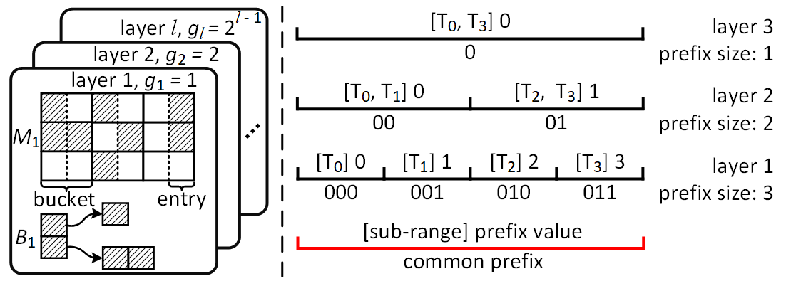
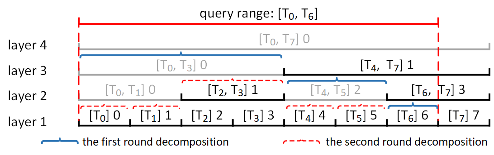

# Horae: A Graph Stream Summarization Structure for Efficient Temporal Range Query
Horae is a graph stream summarization structure for efficient temporal range queries. Horae can deal with temporal queries with arbitrary and elastic range while guaranteeing one-sided and controllable errors. More to the point, Horae provides a worst query time of *O*(*log |L|*), where *|L|* is the length of query range. Hoare leverages multi-layer storage and *Binary Range Decomposition* (*BRD*) algorithm to decompose the temporal range query to logarithmic time interval queries and executes these queries in corresponding layers.

# Introduction

The emerging graph stream represents an evolving graph formed as a timing sequence of elements (updated edges) through a continuous stream. Each element in a graph stream is formally denoted as ($s_i$, $d_i$, $w_i$, $t_i$) ($i \geq 0$), meaning the directed edge of a graph $G=(V,E)$, $i.e.$, $s_i$ $\rightarrow$ $ d_i$ ($s_i \in V$, $d_i \in V$, $s_i$ $\rightarrow$ $d_i$ $\in E$), is produced at time $t_i$ 
with a weight value $w_i$. An edge can appear multiple times at different time instants with different weights. Such a general data form is widely used in big data applications, such as user behavior analysis in social networks, close contact tracking in epidemic prevention, and vehicle surveillance in smart cities.

Real-world big data applications can create tremendously large-scale graph stream data. For example, 902 million WeChat daily active users generate 38 billion messages each day; Tencent Health Code covers more than one billion people and has generated 24 billion health code scans (needed when an individual enters important places, $e.g.$, hospital or airport, during COVID-19). The enormous data scale makes the management of graph streams extremely challenging, especially in the aspects of (1) storing the continuously produced and large-scale datasets, and (2) supporting queries relevant to both graph topology and temporal information.

To address these issues, recent research has mainly focused on graph stream summarization techniques which aim at achieving practicable storage and supporting various queries relevant to graph topology at the cost of slight accuracy sacrifice. Tang $et~al.$ propose TCM, which uses an $m \times m$ ($m \ll |V|$) compressive adjacency matrix $M$ to represent a graph stream. Each bucket in the matrix maintains a weight value initially set to zero. For an element ($s_i$, $d_i$, $w_i$, $t_i$) in the graph stream, TCM adds $w_i$ to the weight value of the bucket at the $h(s_i)^{th}$ row and the $h(d_i)^{th}$ column, $i.e.$, $M[h(s_i)][h(d_i)]$, where $h(\cdot)$ is a hash function with the value range $[1, m]$. Accordingly, TCM can support Boolean and aggregation queries. For example, we can query whether an edge $x \rightarrow y$ exists by checking against the matrix. If $M[h(x)][h(y)] = 0$, $x \rightarrow y$ definitely never appeared in the graph stream; otherwise, it appeared with a high probability. The accumulated weight value of $x$ $\rightarrow$ $y$ can also be obtained as $M[h(x)][h(y)]$. We can further achieve the aggregated weights of all the outgoing edges of $x$ (node aggregation weight query) by computing $\sum_{i=1}^{m}M[h(x)][i]$. To improve the query precision based on a compressive matrix, Gou $et~al.$ propose GSS to alleviate the impact of hash collisions by fingerprinting each edge. However, the storage of fingerprint requires extra memory cost.

Graph summarization structures are useful in different application scenarios. For example, in smart city vehicle surveillance, the volume of captured videos is prohibitively huge for long-term storage. We can recognize vehicle license plates from the captured videos and convert the video streams into a succinct graph stream with each element like ($ACX$-$7581$, $camera$ \#27, $1$, 07:01am 01.01.2020). With graph stream summarization, we can easily answer the query ''was the car $ACX$-$7581$ ever captured by the $camera$ \#27?'' In a data center, communications between servers and clients can also be represented by a graph stream summarization structure. We can obtain the upload traffic of a server with a node aggregation weight query.

However, existing summarization structures are unable to store the temporal information in a graph stream and thus fail to support temporal queries. It is difficult to answer such queries: ''was the car $ACX - 7581$ ever captured by the $camera$ \#27 between 07:01am 01.01.2021 and 23:59pm 02.02.2021?'' and ''what is the total upload traffic volume of the server \#2812 between 15:00pm and 16:00pm?''

It is nontrivial to design a scheme to support such temporal range queries over graph streams. On the one hand, storing the temporal information with an existing graph stream summarization structure in a straightforward way can raise high query latency for a temporal range query. Specifically, for an element ($s_i$, $d_i$, $w_i$, $t_i$), one can add $w_i$ to the value of the bucket $M[h(s_i$ $|$ $t_i)][h(d_i$ $|$ $t_i)]$, where '$|$' represents the concatenation operation of two strings. Accordingly, a simple temporal point query ''did the edge $x$ $\rightarrow$ $y$ appear at time $t$?'' can be answered by checking $M[h(x$ $|$ $t)][h(y$ $|$ $t)]$. However, a temporal range query can not be efficiently evaluated. Formally, a pair of time points $t_b$ and $t_e$ $(t_b \leq t_e)$ can specify a temporal range [$t_b$, $t_e$] with the length $t_e - t_b + 1$. With the existing structures ($e.g.$, TCM), answering such a query ''did the edge $x$ $\rightarrow$ $y$ appear within the time range [$t_b$, $t_e$]?'' needs to discretely evaluate the temporal point query against the structure $t_e-t_b+1$ times. The query processing latency increases linearly with the length of the range, which can be prohibitively costly in practice.


On the other hand, traditional data structures, $e.g.$, the interval tree and the segment tree, cannot address the temporal range query over graph streams. Given a predefined set of intervals, the interval tree recursively builds a binary tree based on the median of the intervals' endpoints, where each tree node stores an interval of the set. The interval tree can only query the data of the given intervals rather than the data of an arbitrary interval. For a certain range boundary, the segment tree first builds a static balanced tree in a bottom-up manner, where the interval of a non-leaf node is the union of the intervals of its two children and the interval of the root is the range boundary. It then inserts data of each point to the nodes where the intervals cover the point. The segment tree provides arbitrary range query within the boundary by aggregating the data of several intervals. However, the segment tree cannot be applied to the dynamic graph stream which is infinite in time dimension and cannot guarantee the data integrity of each level in a one-pass manner. This thus can result in unacceptable query latency.

In this work, we propose Horae, a novel graph stream summarization structure to efficiently support temporal range queries. By exploring a time prefix embedded multi-layer summarization structure, Horae can effectively handle a temporal range query of an arbitrary range length $L$ with a worst query processing time of $O(\log{L})$. The basic idea of Horae's time prefix embedded multi-layer summarization structure is as follows.

An arbitrary temporal range of length $L$ can be decomposed to at most $2\log{L}$ sub-ranges, where all the time points in each sub-range have the same binary code prefix. For example, [$t_{8}$, $t_{13}$] = [$t_8$, $t_{11}$] + [$t_{12}$, $t_{13}$], where all the time points between $t_8$ ($i.e.$, $1000$) and $t_{11}$ ($i.e.$, $1011$) have the same common prefix '10', while all the time points between $t_{12}$ ($i.e.$, $1100$) and $t_{13}$ ($i.e.$, $1101$) have the same prefix '110'. Here, we define the $prefix size$ as the number of binary digits in the common prefix ($e.g.$, the prefix size of '10' is two while that of '110' is three).

A Horae structure contains a number of $l = \lceil\log(t_u+1)\rceil+1$ layers, where $t_u$ is the current time point of a graph stream. To cope with the infinity in the time dimension, the number of layers in Horae dynamically increases as $t_u$ grows. Horae arranges the layers according to different prefix sizes. Each layer leverages a matrix to store the complete graph stream data aggregated by the sub-ranges with the same prefix size. Consider the example with $t_u = t_7$, Horae has four layers. The first layer contains eight sub-ranges \{[$t_0$] ([$0000$]), [$t_1$] ([$0001$]), ..., [$t_7$] ([$0111$])\} with prefix size of four; the second layer contains four sub-ranges \{[$t_0$, $t_1$] ([$0000$, $0001$]), [$t_2$, $t_3$] ([$0010$, $0011$]), ..., [$t_6, t_7$] ([$0110, 0111$])\} with prefix size of three, and so on. Formally, the $p^{th}$ layer aggregates the graph stream data by the sub-ranges \{[${q\cdot2^{p-1}}$, ${(q+1)\cdot2^{p-1}} - 1$] ($q\geq0$)\} with prefix size $l-p+1$. The sub-ranges of each layer have the same prefix size, $i.e.$, the same range length. In a nutshell, each layer of the structure represents a summarization of a graph stream with carefully selected granularity (corresponds to a prefix size). During the construction of each layer, Horae combines each edge with the time prefix of the corresponding size for inserting the edge information to the corresponding matrix. Similarly, Horae combines an edge/node and the sub-range prefix to perform a sub-range query.

To efficiently evaluate temporal range queries on top of the Horae structure, we further design a novel $Binary Range Decomposition$ (BRD) algorithm. The BRD algorithm decomposes a temporal range query with an arbitrary length $L$ into at most $O(\log{L})$ sub-range queries against different layers of the structure. Therefore, Horae reduces the query processing time to a logarithmic scale. Experimental results show that Horae reduces the latency of temporal range queries by two to three orders of magnitude compared to existing designs.


# Horae Architecture
<br/>

The Horae structure contains $l = \lceil \log_{2}(T_u + 1) \rceil + 1 $ layers. It starts with a single layer initially and creates one new layer whenever the current time slice of the graph stream increases to a larger power of two ($T_u = 2^{i}, i \geq 0$). Horae arranges the layers based on different prefix sizes. Each layer aggregates the complete graph stream data by a corresponding prefix size. Figure~\ref{fig:3} illustrates an example, where the right part shows a snapshot with $T_u  = T_3$ and the number of layers is three ($l=$ 3). In the snapshot, the $1^{st}$ layer contains four sub-ranges \{[$T_0$] (000), [$T_1$] (001), ..., [$T_3$] (011)\}, all with the prefix size of three; the $2^{nd}$ layer contains two sub-ranges \{[$T_0$, $T_1$] (<u>00</u>0, <u>00</u>1), [$T_2$, $T_3$] (<u>01</u>0, <u>01</u>1)\}, both with the prefix size of two; the $3^{rd}$ layer contains one sub-range \{[$T_0$, $T_3$] (<u>0</u>00, <u>0</u>11)\} with the prefix size of one. Formally, the $p^{th}$ layer aggregates the graph stream data by the sub-ranges \{$[0$, $2^{p-1} - 1]$, $[2^{p-1}$, $2 \cdot 2^{p-1} - 1]$, ...\} with the same prefix size of $l-p + 1$. All the sub-ranges of the $p^{th}$ layer have the same range length $2^{p-1}$. We define the same range length of each sub-range in the $p^{th}$ layer as the *granularity* of the $p^{th}$ layer. In a word, the $p^{th}$ layer of Horae represents a graph stream summarization of granularity $2^{p-1}$.

# Binary Range Decomposition
<br/>


## How to use?
### Environment
We implement Horae in a Red Hat Enterprise Linux Server release 6.2 with an Intel 2.60GHz CPU and 64GB RAM, the size of one cache line in the server is 64 bytes. 

The g++ version we use is 7.3.0.

Build & Run

```txt
make
./horae
```

### Configurations
Some important parameters setting and theirs descriptions are as follows.
| Command-line parameters | Descriptions                                       |
|:----------------------- | :------------------------------------------------- |
| **-w**                  | the width of the hash matrix                       |
| **-d**                  | the depth of the hash matrix                       |
| **-gl**                 | granularity length                                 |
| **-slot**               | slot numbers of one bucket                         |
| **-fplength**           | fingerprint length                                 |
| **-edgeweight**         | run edge weight query                              |
| **-edgeexistence**      | run edge existence query                           |
| **-nodeinweight**       | run node-in aggregated weight query                |
| **-nodeoutweight**      | run node-out aggregated weight query               |
| **-bool**               | run bool query                                     |
| **-dataset**            | choose dataset for testing                         |
| **-filename**           | the file path of dataset                           |
| **-input_dir**          | the folder path of input files                     |
| **-output_dir**         | the folder path of output files                    |
| **-para_ins**           | parallel insertion                                 |
| **-seq_ins**            | serial insertion                                   |
| **-para_query**         | execute query tasks in parallel                    |
| **-seq_query**          | execute query tasks serially                       |
| **-baseline**           | run baseline code                                  |
| **-horae**              | run horae code                                     |
| **-row_addrs**          | number of alternative addresses for matrix rows    |
| **-col_addrs**          | number of alternative addresses for matrix columns |
| **-kick**               | add kick out stategy                               |
| **-cache_align**        | add cache align stategy                            |
| **-write**              | output test results to file                        |


We give a simple example of how to use these parameters:
``` code
e.g. ./horae -dataset <int> -filename <path> -w <int> -d <int> -gl <int> -fplength <int> -horae -para_ins -slot <int> -edgeweight -write -input_dir <path> -output_dir <path>
e.g. ./horae -dataset 9 -filename Dataset/stackoverflow -horae -para_ins -w 5656 -d 5656 -gl 86400 -qtimes 1 -edgeweight -write -output_dir TestFiles/stk-test/output/ -fplength 14 -kick -cache_align 
```


## Author and Copyright

Horae is developed in National Engineering Research Center for Big Data Technology and System, Cluster and Grid Computing Lab, Services Computing Technology and System Lab, School of Computer Science and Technology, Huazhong University of Science and Technology, Wuhan, China by Ming Chen (mingc@hust.edu.cn), Renxiang Zhou (mr\_zhou@hust.edu.cn), Hanhua Chen (chen@hust.edu.cn), Jiang Xiao (jiangxiao@hust.edu.cn), Hai Jin (hjin@hust.edu.cn).

Copyright (C) 2020, [STCS & CGCL](http://grid.hust.edu.cn/) and [Huazhong University of Science and Technology](http://www.hust.edu.cn).

Licensed under the Apache License, Version 2.0 (the "License");
you may not use this file except in compliance with the License.
You may obtain a copy of the License at

      http://www.apache.org/licenses/LICENSE-2.0

Unless required by applicable law or agreed to in writing, software
distributed under the License is distributed on an "AS IS" BASIS,
WITHOUT WARRANTIES OR CONDITIONS OF ANY KIND, either express or implied.
See the License for the specific language governing permissions and
limitations under the License.